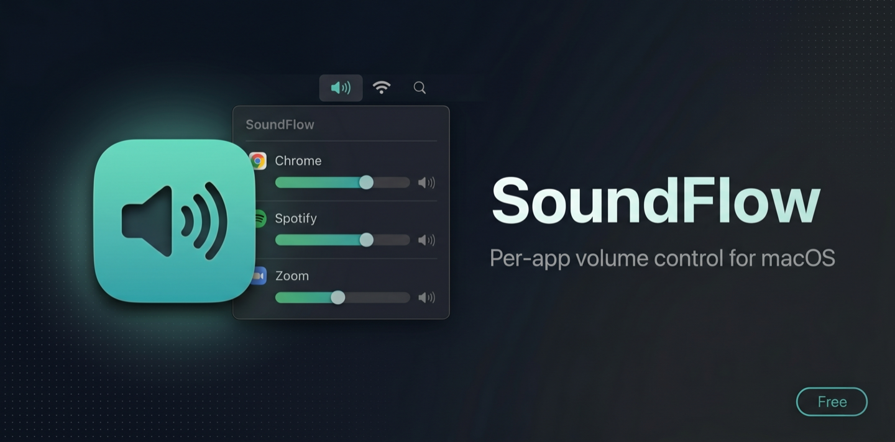
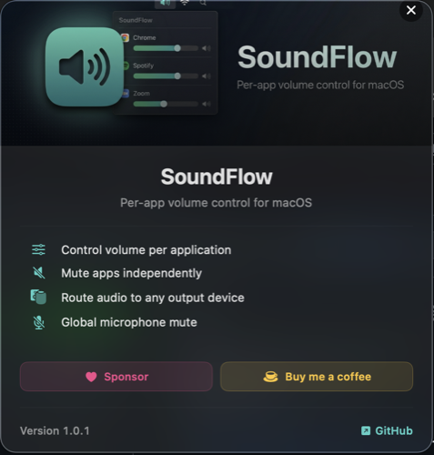
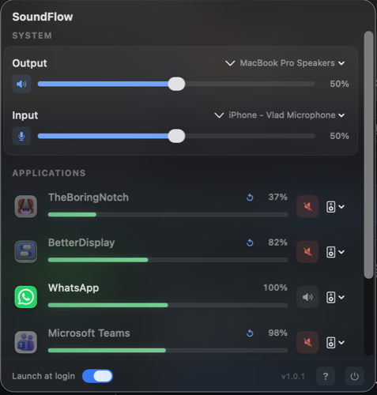

  

  <strong>Per-app volume control and audio routing for macOS</strong> 
  Control volume for each app independently. Route audio to different output devices. Native, lightweight, free.

  
  
  
  

  
  
  
  

  
  

  Built with Swift and SwiftUI. No Electron, no web views, no bloat.

---

## Features

- **Per-app volume control** — Adjust volume independently for Chrome, Spotify, Zoom, and any other audio-producing app
- **Per-app mute** — Silence individual apps without affecting others
- **Audio routing** — Send each app's audio to a different output device (speakers, headphones, AirPods)
- **System volume & input controls** — Manage your default output device and microphone from the menu bar
- **Global microphone mute** — One-click mute that works across all apps
- **Smart app detection** — Automatically discovers audio-producing apps, including Chrome helpers and Electron apps
- **Lightweight & native** — Built with Swift 6 and SwiftUI. No daemons, no kernel extensions, no virtual audio drivers
- **Lives in your menu bar** — Stays out of your way until you need it
- **Free & open** — No ads, no subscriptions, no telemetry

---

## Screenshots

  
  &nbsp;&nbsp;
  

---

## Download

Download the latest version from [**Releases**](https://github.com/beyondthecode-bc/SoundFlow/releases/latest). Unzip, drag `SoundFlow.app` to your Applications folder, and launch.

## Requirements

| | Requirement |
|---|---|
| **OS** | macOS 14.2 (Sonoma) or later |
| **Chip** | Any Mac (Apple Silicon or Intel) |

> SoundFlow uses the Core Audio Tap API which was introduced in macOS 14.2. Earlier versions are not supported.

## Permissions

On first launch, SoundFlow needs **Screen & System Audio Recording** permission to read audio streams from other apps. This is the standard permission for the Core Audio Tap API — it does **not** record your screen.

To grant access:
1. Click the SoundFlow menu bar icon and try to adjust an app's volume
2. macOS will prompt you to grant permission
3. Click **Open System Settings**, then enable SoundFlow under **Privacy & Security > Screen & System Audio Recording**
4. Quit and relaunch SoundFlow

## Updates

SoundFlow has a built-in update checker. Click the version number at the bottom-left of the menu bar popover to:
- Automatically check GitHub for newer releases
- Download the update directly
- Install with one click (macOS will ask for your password)

You can also browse releases manually on the [Releases page](https://github.com/beyondthecode-bc/SoundFlow/releases/latest).

---

## Translations

This repository hosts the translation files for SoundFlow. You can help translate the app into your language or improve existing translations.

### How to contribute

1. Fork this repository
2. Edit an existing file in the [`languages/`](languages/) folder, or create a new one by copying `English.xml`
3. Translate the string values (the text between `<string>` tags) — **do not** change the `key` attributes
4. Keep any `%1`, `%2`, `%@`, `%d` placeholders in place — the app needs them
5. Submit a pull request

### Current languages

| Language | File | Status |
|---|---|---|
| English | [`English.xml`](languages/English.xml) | Complete |

Want to add a new language? Copy `English.xml`, rename it to your language name (e.g. `French.xml`), translate the values, and submit a PR.

## Bug Reports & Feature Requests

Please use [Issues](../../issues) to report bugs or request features.

## Support the Project

If SoundFlow is useful to you, consider supporting development:

  
  &nbsp;&nbsp;&nbsp;
  

---

## Troubleshooting

### "SoundFlow" Not Opened — Gatekeeper warning

SoundFlow is signed with an ad-hoc signature (not yet notarized with Apple). On first launch you may see a Gatekeeper warning.

**To fix this:**

1. Click **Done** to dismiss the dialog
2. Open **System Settings > Privacy & Security**
3. Scroll down — you'll see a message that SoundFlow was blocked
4. Click **Open Anyway**

This only needs to be done once. After that, the app will open normally.

### Volume slider doesn't affect an app

Some apps need a moment to attach their audio stream. Try playing audio in the app first, then adjust the volume. If it still doesn't work, the app may be using a non-standard audio path (e.g. virtual audio drivers like BlackHole).

### App not appearing in the list

SoundFlow only shows apps that have a real app icon. Background daemons and helper processes are filtered out automatically. If your app uses Electron or web views, the audio may come from a helper process — SoundFlow detects this and shows the parent app's name.

---

## License

[MIT](LICENSE) © Beyond the Code
